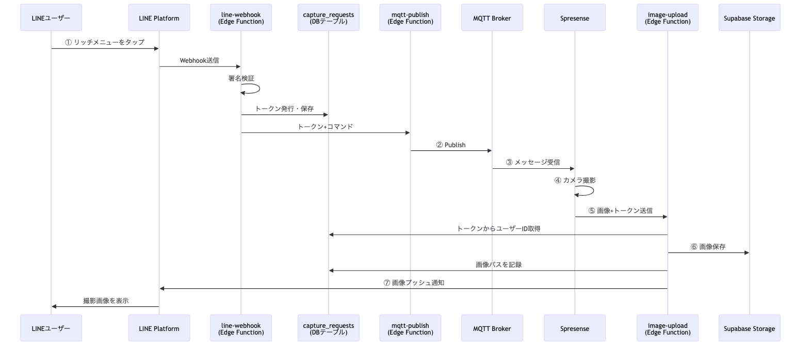
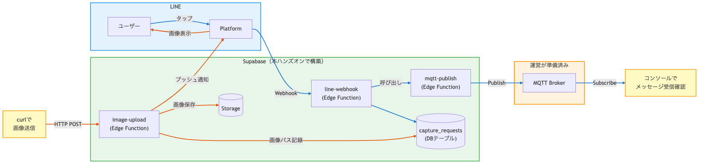

# LINEで現実を操作する！IoTカメラとクラウドを繋ぐフィジカルAI入門ハンズオン(クラウド側)

LINEからSpresenseのカメラを遠隔操作し、撮影した写真をLINEで受け取るシステムを90分で構築します。
クラウド基盤にSupabase、メッセージングにMQTTを使い、サーバーレスなIoTシステムの全体像を体験します。

## 前提条件

- GitHubアカウントを持っていること
- LINEアカウントを持っていること

## アジェンダ

| 時間 | 内容 |
|---|---|
| 0:00〜0:10 | 1. システム全体像の説明・CodeSpaces起動 |
| 0:10〜0:25 | 2. Supabaseアカウント・プロジェクト作成 |
| 0:25〜0:45 | 3. LINE Developersチャネル作成・リッチメニュー設定 |
| 0:45〜0:55 | 4. 環境変数設定・Storage・テーブル作成 |
| 0:55〜1:10 | 5. Edge Functions解説・デプロイ |
| 1:10〜1:30 | 6. Webhook設定・動作テスト |

---

## 1. システム全体像の説明・CodeSpaces起動（10分）

### システム構成

```
LINE <-> Supabase <-> MQTT Broker <-> Spresense
```

### 処理フロー



### このハンズオン（クラウド側）で行うこと

本ハンズオンはクラウド側とデバイス側に分かれています。このガイドはクラウド側の手順書です。



**クラウド側（本ハンズオン）の範囲：**
- Supabaseプロジェクトの作成・設定
- LINE Developersチャネル作成・リッチメニュー設定
- Supabase Edge Functionsの解説・デプロイ
- 動作確認（MQTTメッセージ送信の確認、curlによる画像アップロードのシミュレーション）

**運営側が事前に準備済み：**
- MQTT Broker（接続情報は講師から案内します）

**デバイス側（別ハンズオン）の範囲：**
- Spresenseの初期設定・プログラム書き込み
- MQTTメッセージの受信とカメラ撮影
- 撮影画像のHTTPアップロード

### 実装するEdge Function

| Function | 役割 |
|---|---|
| `line-webhook` | LINEからのWebhookを受け取り、署名検証後にMQTT Publishを呼び出す |
| `mqtt-publish` | MQTT Brokerにカメラ撮影指示を送信する |
| `image-upload` | Spresenseから画像を受け取り、Storageに保存してLINEに通知する |

### CodeSpacesの起動

1. リポジトリページを開く
2. **Code** > **Codespaces** > **Create codespace on main** をクリック
3. 起動完了まで待つ（Supabase CLI・mosquittoが自動インストールされます）
4. このファイル（`HANDSON.md`）を右クリック > **Open Preview** で手順書を表示

---

## 2. Supabaseアカウント・プロジェクト作成（15分）

### アカウント作成

1. https://supabase.com にアクセス
2. **Start your project** をクリック
3. GitHubアカウントでサインアップ

### プロジェクト作成

1. **New Project** をクリック
2. 以下を入力：
   - **Project name**: `spresense-handson`
   - **Database Password**: 任意のパスワード（メモしておく）
   - **Region**: `Northeast Asia (Tokyo)`
3. **Create new project** をクリック
4. プロジェクトの作成完了まで待つ（1〜2分）

### アクセストークンの取得

1. https://supabase.com/dashboard/account/tokens にアクセス
2. **Generate new token** をクリック
3. トークン名を入力して生成
4. 表示されたトークンをコピー（この画面を閉じると再表示できません）

### CLIからプロジェクトにリンク

CodeSpacesのターミナルで以下を実行します：

```bash
# 作業ディレクトリに移動
cd 02_cloud/supabase

# Supabase CLIでログイン
supabase login --token your-access-token

# プロジェクトにリンク
# Project RefはSupabase Dashboard > Project Settings > Generalから確認
supabase link --project-ref your-project-ref
```

---

## 3. LINE Developersチャネル作成・リッチメニュー設定（20分）

### LINE公式アカウントの作成

1. https://manager.line.biz にアクセス
2. LINEビジネスIDでログイン（未登録の場合は新規作成）
3. **アカウントを作成** をクリック
4. 必要事項を入力して作成（アカウント名は任意、例: `Spresense Camera`）

### Messaging APIの有効化

> **注意**: 2024年9月以降、LINE DevelopersコンソールからMessaging APIチャネルを直接作成する方法は廃止されました。LINE Official Account ManagerからMessaging APIを有効化します。

1. 作成したアカウントの管理画面を開く
2. 画面右上の **設定** をクリック
3. 左メニューから **Messaging API** を選択
4. **Messaging APIを利用する** をクリック
5. プロバイダーの選択画面が表示される
   - 新規の場合: プロバイダー名を入力して作成（例: `spresense-handson`）
   - 既存の場合: リストから選択
6. **同意する** をクリック
7. LINE Developersコンソール側にもMessaging APIチャネルが自動作成される

### 認証情報の取得

https://developers.line.biz/console/ にログインし、作成されたチャネルを開きます。

**Channel Secret**:
1. **チャネル基本設定** タブを開く
2. **チャネルシークレット** をコピー

**Channel Access Token**:
1. **Messaging API設定** タブを開く
2. ページ下部の **チャネルアクセストークン（長期）** の **発行** をクリック
3. 表示されたトークンをコピー

### リッチメニューの設定

1. LINE Official Account Managerに戻る
2. 左メニューから **リッチメニュー** を選択
3. **作成** をクリック
4. テンプレートを選択（ボタン1つのシンプルなもの）
5. ボタンに「撮影」などのラベルを設定
6. アクションタイプ: **テキスト**、テキスト: `capture`
7. 保存

### Botの友だち追加

1. LINE Developersコンソールで作成したチャネルを開く
2. **Messaging API設定** タブを開く
3. 画面に表示されている **QRコード** をスマホのカメラまたはLINEアプリのQRコードリーダーで読み取る
4. 友だち追加画面が表示されるので **追加** をタップ
5. トーク画面を開き、Botとのチャットが表示されることを確認

---

## 4. 環境変数設定・Storage・テーブル作成（10分）

### 環境変数の設定

まず `.env.example` をコピーして `.env` ファイルを作成します。

```bash
cp .env.example .env
```

`.env` ファイルを開き、各値を自分の環境に置き換えてください。

```
# LINE Messaging API
LINE_CHANNEL_ACCESS_TOKEN=your_line_channel_access_token_here
LINE_CHANNEL_SECRET=your_line_channel_secret_here

# MQTT Broker
MQTT_BROKER_URL=your_mqtt_broker_hostname
MQTT_TOPIC=spresense/mqtt_sub

# Supabase
SUPABASE_URL=https://your-project.supabase.co
SUPABASE_ANON_KEY=your_supabase_anon_key_here
SUPABASE_SERVICE_ROLE_KEY=your_supabase_service_role_key_here
```

| 環境変数 | 取得元 |
|---|---|
| `LINE_CHANNEL_ACCESS_TOKEN` | 手順3で取得したチャネルアクセストークン（長期） |
| `LINE_CHANNEL_SECRET` | 手順3で取得したチャネルシークレット |
| `MQTT_BROKER_URL` | 講師から案内します |
| `MQTT_TOPIC` | 講師から案内します |
| `SUPABASE_URL` | Supabase Dashboard > **Settings** > **API Keys** > **Project URL** |
| `SUPABASE_ANON_KEY` | Supabase Dashboard > **Settings** > **API Keys** > **Publishable key** |
| `SUPABASE_SERVICE_ROLE_KEY` | Supabase Dashboard > **Settings** > **API Keys** > **Secret key** |

`.env` を編集したら、Supabaseにシークレットとして登録します。

```bash
# .envファイルからシークレットを一括登録
supabase secrets set --env-file .env
```

### Storageバケット作成

Supabase Dashboardで画像保存用のバケットを作成します：

1. 左メニューから **Storage** を開く
2. **Create a new bucket** をクリック
3. バケット名: `spresense-images`
4. **Public bucket**: チェックを入れる（画像をLINEで表示するため）
5. **Create** をクリック

### キャプチャリクエスト管理テーブルの作成

セキュリティのため、LINEのユーザーIDはMQTTブローカーに流さず、UUIDトークンで管理します。

1. 左メニューから **SQL Editor** を開く
2. 以下のSQLを貼り付けて **Run** をクリック

```sql
create table capture_requests (
  request_token uuid primary key default gen_random_uuid(),
  line_user_id text not null,
  status text not null default 'pending',
  image_path text,
  error_message text,
  used_at timestamptz,
  created_at timestamptz not null default now()
);

create index idx_capture_requests_token on capture_requests(request_token);
```

3. **Table Editor** を開き、`capture_requests` テーブルが作成されていることを確認

---

## 5. Edge Functions解説・デプロイ（15分）

### Edge Functionsの構成

```
functions/
├── line-webhook/index.ts   ... LINE Webhook受信・署名検証・トークン発行
├── mqtt-publish/index.ts   ... MQTT Brokerへのメッセージ送信
└── image-upload/index.ts   ... 画像保存・LINE通知
```

### ① `line-webhook` — LINE Webhook受信・署名検証・トークン発行

LINEからのWebhookを受信し、署名を検証してからmqtt-publishを呼び出します。

**署名検証**: LINEからのリクエストが正規のものか、Channel Secretを使ったHMAC-SHA256で検証します。

```typescript
const hash = createHmac("sha256", channelSecret)
  .update(body)
  .digest("base64");

if (hash !== signature) {
  // 署名が一致しなければ不正なリクエストとして拒否
}
```

**トークン発行**: `capture_requests` テーブルにLINEユーザーIDを保存し、UUIDトークンを取得します。MQTTにはこのトークンだけを流すため、ユーザーIDが外部に漏れません。

```typescript
const { data } = await supabase
  .from("capture_requests")
  .insert({ line_user_id: userId })
  .select("request_token")
  .single();
```

**mqtt-publishの呼び出し**: トークンとコマンドを渡してEdge Functionを内部呼び出しします。

```typescript
await fetch(`${supabaseUrl}/functions/v1/mqtt-publish`, {
  method: "POST",
  headers: {
    "Content-Type": "application/json",
    "Authorization": `Bearer ${supabaseAnonKey}`,
  },
  body: JSON.stringify({
    requestToken: data.request_token,
    command: "capture",
  }),
});
```

---

### ② `mqtt-publish` — MQTT Brokerへのメッセージ送信

UUIDトークンとコマンドをJSON形式でMQTT Brokerにpublishします。

**メッセージ作成**: Spresenseが受信するJSONペイロードを組み立てます。

```typescript
const payload = JSON.stringify({
  requestToken: requestToken,
  command: command,
  timestamp: new Date().toISOString(),
});
```

**MQTT接続とPublish**: Brokerに接続し、指定トピックにメッセージを送信します。5秒でタイムアウトします。

```typescript
const client = mqtt.connect(`mqtt://${mqttBrokerUrl}:1883`);

client.on("connect", () => {
  client.publish(mqttTopic, payload, { qos: 1 }, (err) => {
    client.end();
  });
});
```

---

### ③ `image-upload` — 画像保存・LINE通知

Spresenseから画像とUUIDトークンを受け取り、Storageに保存してLINEに通知します。

**トークンからユーザーID取得**: トークンで `capture_requests` を検索し、LINEユーザーIDを取得します。使用済みトークンの再利用も防止します。

```typescript
const { data: requestData } = await supabase
  .from("capture_requests")
  .select("line_user_id, used_at")
  .eq("request_token", requestToken)
  .single();

// 使用済みトークンの再利用を防止
if (requestData.used_at) {
  // エラーを返す
}
```

**Storageに画像保存**: タイムスタンプ付きのファイル名で画像をアップロードし、公開URLを取得します。

```typescript
const fileName = `${requestToken}_${timestamp}.jpg`;

await supabase.storage
  .from("spresense-images")
  .upload(fileName, imageFile, {
    contentType: "image/jpeg",
    upsert: false,
  });

const { data: urlData } = supabase.storage
  .from("spresense-images")
  .getPublicUrl(fileName);
```

**LINEにプッシュ通知**: 保存した画像のURLをLINE Messaging APIで送信します。

```typescript
const lineMessage = {
  to: userId,
  messages: [{
    type: "image",
    originalContentUrl: imageUrl,
    previewImageUrl: imageUrl,
  }],
};

await fetch("https://api.line.me/v2/bot/message/push", {
  method: "POST",
  headers: {
    "Content-Type": "application/json",
    "Authorization": `Bearer ${lineChannelAccessToken}`,
  },
  body: JSON.stringify(lineMessage),
});
```

**ステータス更新**: 成功時に画像パスとステータスを `capture_requests` に記録します。

```typescript
await supabase
  .from("capture_requests")
  .update({ status: "sent", image_path: fileName, used_at: new Date().toISOString() })
  .eq("request_token", requestToken);
```

### デプロイ

CodeSpacesのターミナルで以下を実行します：

```bash
# Edge Functionsをデプロイ
# 外部（LINE/Spresense）から直接呼ばれるため、JWT検証を無効化する
supabase functions deploy line-webhook --no-verify-jwt
supabase functions deploy mqtt-publish --no-verify-jwt
supabase functions deploy image-upload --no-verify-jwt
```

---

## 6. Webhook設定・動作テスト（20分）

### LINE Webhook URLの設定

1. LINE Developers Consoleでチャネルを開く
2. **Messaging API設定** タブを開く
3. **Webhook URL** に以下を入力（`your-project` 部分は `.env` の `SUPABASE_URL` のホスト名に置き換え）：

```
https://your-project.supabase.co/functions/v1/line-webhook
```

4. **Webhook利用** をオンにする
5. **検証** ボタンで接続テスト

### テスト1: MQTTメッセージの確認（ハンズオン前半）

mosquitto_subでMQTTメッセージの受信を確認します。

```bash
# ターミナルでsubscribeを開始（your-broker-hostは.envのMQTT_BROKER_URLに置き換え）
mosquitto_sub -h your-broker-host -p 1883 -t "spresense/mqtt_sub"
```

subscribe状態のまま、LINEのリッチメニューからボタンをタップします。
以下のようなメッセージが表示されれば成功です：

```json
{"requestToken":"550e8400-e29b-41d4-a716-446655440000","command":"capture","timestamp":"2026-04-11T06:00:00.000Z"}
```

MQTTメッセージには `requestToken`（UUID）が含まれます。

### テスト2: 画像アップロードの確認（ハンズオン前半・Spresenseなしで確認）

PCからcurlコマンドでSpresenseの動作をシミュレートし、画像アップロード〜LINE通知の流れを確認します。

```bash
# testdataディレクトリにテスト用画像（neko.jpg）を配置してから実行
# YOUR_REQUEST_TOKENはテスト1で受信したrequestTokenに置き換え
curl -X POST https://your-project.supabase.co/functions/v1/image-upload \
  -F "image=@testdata/neko.jpg" \
  -F "requestToken=YOUR_REQUEST_TOKEN"
```

成功すると、Supabase Storageに画像が保存され、LINEに画像がプッシュ通知されます。

### テスト3: Spresenseとの結合テスト（ハンズオン後半）

Spresenseを接続し、LINEのリッチメニューからボタンをタップします。
数秒後、LINEに撮影された画像が送信されれば完成です。

### トラブルシューティング

Edge Functionのログを確認して原因を特定します：

1. Supabase Dashboardを開く
2. 左メニューから **Edge Functions** を選択
3. 対象のFunction（`line-webhook` / `mqtt-publish` / `image-upload`）をクリック
4. **Logs** タブでエラー内容を確認

| 症状 | 確認ポイント |
|---|---|
| LINE認証エラー | Channel SecretとAccess Tokenを確認 |
| MQTT接続エラー | Broker URLとトピック名を確認 |
| 画像アップロードエラー | Storageのバケット設定を確認 |
| トークンエラー | capture_requestsテーブルの作成を確認 |
